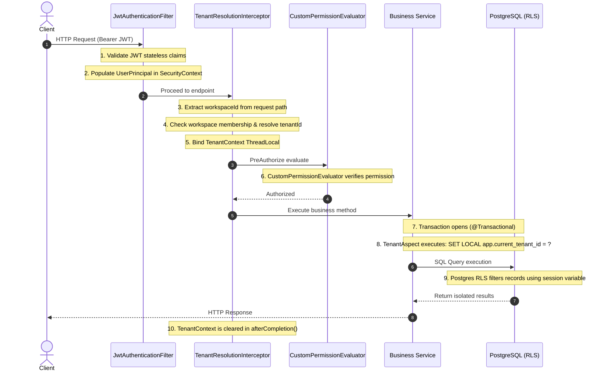

# Nimbus — Production-Grade, Multi-Tenant B2B SaaS Backend

Nimbus is a production-grade, multi-tenant B2B SaaS backend architecture modeled after modern enterprise collaboration and productivity platforms (such as Notion, Linear, and Jira). Designed specifically to showcase high-level backend engineering rigor, this portfolio project prioritizes core security isolation, architectural boundaries, and performance correctness over simple feature breadth.

---

## 🚀 Key Architectural Pillars

### 1. Multi-Tenancy via Postgres Row-Level Security (RLS)
Nimbus uses a **Shared Database, Shared Schema** approach. Every tenant-scoped table contains a `tenant_id` column indexed as the leading column in composite indexes. 
* **Defense-in-Depth:** Scoping is enforced at three levels: JWT Claims $\rightarrow$ Service-Layer Guards $\rightarrow$ Postgres RLS policies.
* **Aspect-Oriented Scope Injection:** A Spring AOP Aspect intercepts `@Transactional` boundaries. Upon transaction start, it executes `SET LOCAL app.current_tenant_id = 'tenant-uuid';` on the connection. The variable is automatically discarded when the transaction commits or rolls back, preventing tenant context leaks.
* **Forced RLS:** All tenant tables use `FORCE ROW LEVEL SECURITY` to ensure that database owners, migration runners, and local queries are strictly isolated.

### 2. Strict Modular Monolith Boundaries
To balance maintainability with microservice-like decoupling, Nimbus is structured as a **Modular Monolith**.
* Packages are partitioned by domain module (`identity`, `tenant`, `workspace`, `rbac`, `tasks`, `notifications`, `audit`).
* Entities do not cross module boundaries. For instance, `WorkspaceMembership` references users by plain `UUID` values, rather than using Hibernate `@ManyToOne` bindings to the `User` entity.
* Sync module communication occurs via defined service interfaces, and async communication runs decoupling events via Spring `ApplicationEventPublisher`.

### 3. Bulletproof Auth & Refresh Token Rotation (RFC 6819)
Authentication uses stateless JWT access tokens (~15 mins) combined with database-backed opaque refresh tokens with single-use rotation.
* **One-Way Hashing:** Refresh tokens are hashed using `SHA-256` before database persistence to secure sessions against DB read compromises.
* **Session Family Revocation (Breach Detection):** If a client presents an already-revoked refresh token, it is flagged as a replay attack. The system immediately revokes the entire session chain (session family) associated with that user to terminate both the attacker's and victim's access.

### 4. Transactional Outbox Pattern for Asynchronous Events
To solve the dual-write problem (e.g. updating task status succeeding while the downstream audit/notification delivery fails), Nimbus writes both business records and outbound event payloads to an `outbox_events` table within the same ACID database transaction.
* **Concurrent Row-Skipping Polling:** A background worker polls pending events using a lock query with row skipping: `SELECT ... FOR UPDATE SKIP LOCKED LIMIT 100`. This enables horizontal scaling across multiple running instances without duplicate event processing.

---

## 🛠️ Technology Stack

* **Core Framework:** Java 21, Spring Boot 3.4.1, Spring Security 6
* **Database & Cache:** PostgreSQL 16, Redis 7 (caching, rate limiting)
* **Migrations:** Flyway
* **Local Infra:** Docker, Docker Compose
* **Testing:** JUnit 5, MockMvc, AssertJ, Testcontainers (PostgreSQL integration)
* **API Documentation:** Springdoc OpenAPI / Swagger UI

---

## 📋 Request Lifecycle Flow



---

## 📁 Repository Directory Structure

```
C:\Users\dell\Desktop\FUN\Nimbus
├── artifacts/                  # System design plans, HLDs, and architectural plans
├── docker-compose.yml          # Local PostgreSQL 16 & Redis 7 stack
├── pom.xml                     # Maven dependencies config (Java 21, Spring Boot 3.4.1)
├── README.md                   # Project overview & documentation
└── src
    ├── main
    │   ├── java\com\nimbus
    │   │   ├── NimbusApplication.java      # Monolith startup entrypoint
    │   │   ├── identity                     # Global identities, JWT filters, Auth Service
    │   │   ├── rbac                         # Roles, permissions, CustomPermissionEvaluator
    │   │   ├── tenant                       # Tenant context ThreadLocal, TenantAspect, Interceptors
    │   │   └── workspace                    # Workspace management and memberships
    │   └── resources
    │       ├── application.yml              # Local configs, database keys, JWT variables
    │       └── db\migration                 # Flyway migration scripts (Init schema + RLS policies)
    └── test
        └── java\com\nimbus
            ├── tenant                       # Tenant isolation RLS integration tests
            ├── identity                     # Login, signup, refresh rotation integration tests
            └── rbac                         # Interceptor & authorization integration tests
```

---

## 🚀 Local Development Setup

### Prerequisites
* Java 21 or higher
* Maven 3.9+
* Docker Desktop (Engine running)

### 1. Spin up Local Database and Redis Cache
```bash
docker compose up -d
```
Verify the containers are healthy and running:
```bash
docker ps
```

### 2. Build the Application
Run Maven compiler to verify class loading and dependencies:
```bash
mvn clean compile
```

### 3. Run the Tests
Execute the full suite of integration tests (validating token rotation, RLS isolation boundaries, and security rules):
```bash
mvn test
```

### 4. Boot the Server Locally
```bash
mvn spring-boot:run
```
Once booted, the API documentation is available at:
* Swagger UI: `http://localhost:8080/swagger-ui/index.html`
* OpenAPI JSON Spec: `http://localhost:8080/v3/api-docs`

---

## 💡 Interview Deep Dives: Explaining the Architecture

When discussing this architecture in SDE interviews, be prepared to explain the rationale behind these decisions:

### Why choose Option B (Request Path Tenant Resolution) instead of Tenant-Scoped JWTs?
In standard B2B applications, users switch between multiple workspaces frequently. Storing the `tenant_id` inside the JWT claim forces the client to swap and request new tokens every time they toggle between workspaces. Resolving the tenant dynamically from the request path (`/api/v1/workspaces/{workspaceId}/...`) allows the client to use a single global token, while the backend takes care of resolving context and verifying workspace memberships under the hood.

### Why execute `SET LOCAL` inside an Aspect instead of wrapping the Datasource?
Using a Spring AOP Aspect on `@Transactional` methods leverages Postgres `SET LOCAL` commands. This scopes the session variable strictly to the current database transaction lifecycle. If a connection is released back to the Hikari pool, the local variables are automatically dropped by Postgres, completely preventing tenant leakage to subsequent queries using that pooled connection.

### How do we verify RLS doesn't fail silently?
Because RLS in Postgres fails silently (it will simply return 0 rows if a policy is missing), we implement a CI verification test. The test queries the Postgres system catalog (`pg_class` and `pg_policy`) to verify that every table containing a `tenant_id` column has row-level security enabled (`rowsecurity = true`) and a policy defined.